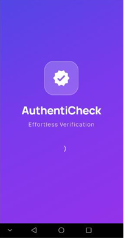
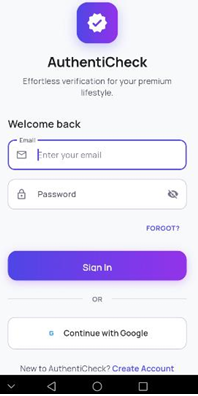
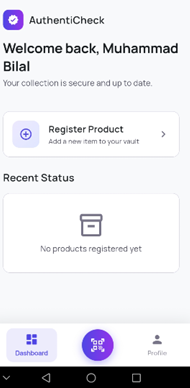
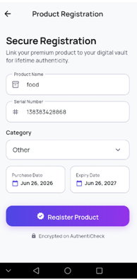
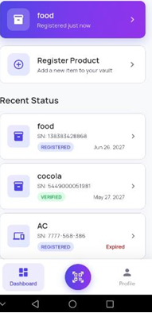
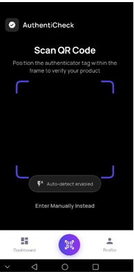
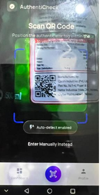

# QR Product Registration App

A Flutter-based mobile application that enables users to register products by scanning QR codes, securely manage product information, and receive expiration reminders.
The app integrates Firebase Authentication and Cloud Firestore for secure user management and cloud data storage.

---

## 📱 Features

- 🔐 Sign in with Google
- 👤 User Authentication using Firebase
- 📷 QR Code Scanner
- 📝 Manual Product Registration
- 📦 Product Management Dashboard
- 📅 Purchase & Expiry Date Tracking
- ⏰ Expiry Reminder Settings
- 🔔 Advance Notification Preferences
- ☁️ Cloud Firestore Integration
- 👤 User Profile & Settings
- 📱 Clean and Responsive Flutter UI

---

## 🛠 Tech Stack

- Flutter
- Dart
- Firebase Authentication
- Cloud Firestore
- Google Sign-In
- Mobile Scanner (QR Scanner)
- Shared Preferences

---

## 📂 Project Structure

```
lib/
├── core/
├── models/
├── services/
├── repositories/
├── viewmodels/
├── views/
│   ├── auth/
│   ├── dashboard/
│   ├── scanner/
│   ├── product/
│   └── profile/
├── widgets/
└── main.dart
```

---

## App Screenshots

### Splash Screen


### Login Screen


### Dashboard


### Product Registration


### Updated Dashboard


### QR Scanner


###  Scan Product


---

## 🚀 Getting Started

### Clone the Repository

```bash
git clone https://github.com/your-username/qr-product-registration-app.git
```

### Navigate to the Project

```bash
cd qr-product-registration-app
```

### Install Dependencies

```bash
flutter pub get
```

### Run the App

```bash
flutter run
```

---

## 🔥 Firebase Setup

1. Create a Firebase project.
2. Enable **Google Authentication**.
3. Enable **Cloud Firestore**.
4. Add your Android SHA-1 fingerprint.
5. Download the `google-services.json` file.
6. Place it in:

```
android/app/google-services.json
```

---

## 📌 Future Improvements

- Push Notifications
- Email & SMS Reminders
- Product Warranty Tracking
- Product History
- Product Categories
- Multi-device Synchronization
- Dark Mode
- Product Search & Filters

---

## 👨‍💻 Author

**Muhammad Abdur Rehman**

- LinkedIn: https://www.linkedin.com/in/rehman090
- GitHub: https://github.com/CodeWith-AR

---

## 📄 License

This project is developed for educational and portfolio purposes.
